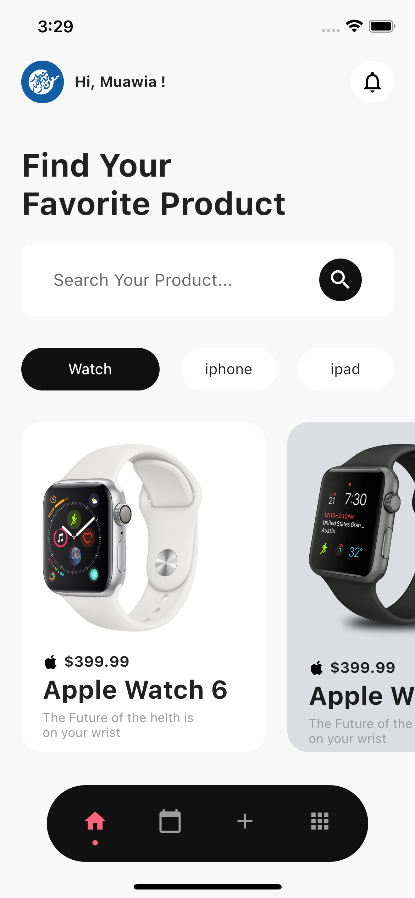

# Flutter Store App UI Home Page With Getx

A new Flutter UI Project on my Youtube Channel .

## About The Project

Create a beautiful Flutter UI Store App With Getx State Management & Get CLI

> Links : for the tutrials Videos

- [tutrial](https://youtu.be/RU5f6YPBvv8)
- [My youtube Channel](https://www.youtube.com/channel/UCnUh8WaDvVs1b0CbOv7UaWQ)

## Plugins

Coffee App is currently extended with the following plugins.
Instructions on how to use them in your own application are linked below.

| Plugin          | Link                                             |
| --------------- | ------------------------------------------------ |
| GetX            | https://pub.dev/packages/get                     |
| Get CLI         | https://pub.dev/packages/get_cli                 |
| floating_navbar | https://pub.dev/packages/floating_navbar/install |

#Screen Shots

 

| Screen Shot                           |
| ------------------------------------- |
|  |
